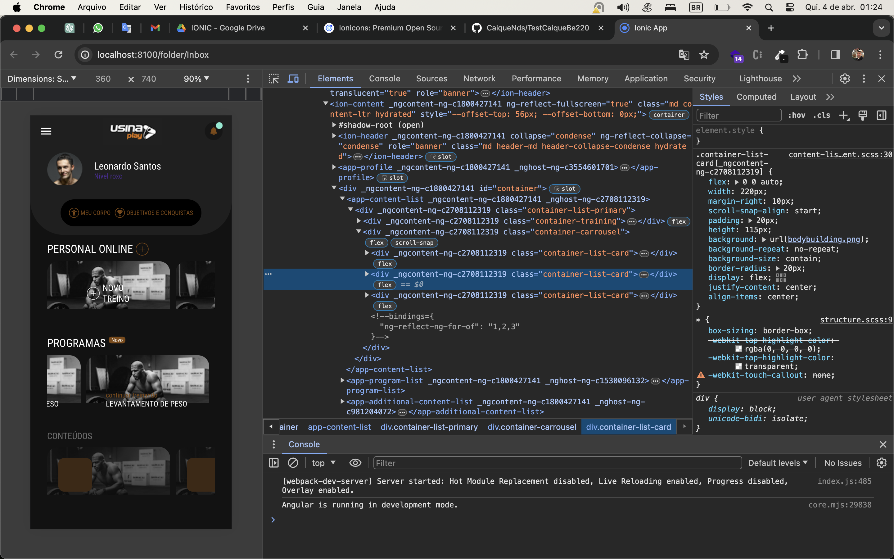

# Projeto Ionic 7 com Angular

Este projeto consiste em uma aplicação Ionic 7 com Angular que replica uma tela específica. O projeto foi organizado em componentes para facilitar a manutenção e a escalabilidade do código.

## Requisitos do Sistema

- Node.js 18+
- Ionic CLI

Certifique-se de ter o Node.js na versão 18 ou superior instalado no seu sistema. 

## Resultado do teste:

